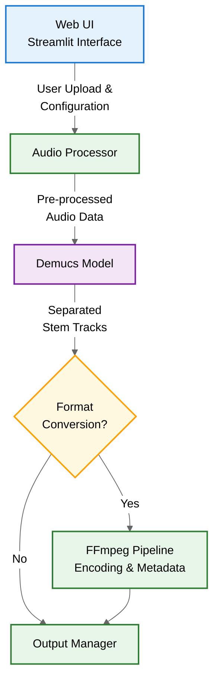

# Sol Audio Stem Splitter

[](https://www.python.org/downloads/)
[](https://opensource.org/licenses/Apache-2.0)
[](https://pytorch.org/)

Professional audio separation solution leveraging cutting-edge machine learning to isolate vocal and instrumental tracks with studio-grade quality. Engineered for music production workflows and audio post-processing.

## 📥 Download & Installation

### Prerequisites
- **Python**: 3.9+ (with pip 22.3+)
- **NVIDIA Stack** (GPU acceleration):
  - **Drivers**: 520.56.06+ ([CUDA 11.8 Compatible](https://docs.nvidia.com/cuda/cuda-toolkit-release-notes/index.html#cuda-major-component-versions))
  - **CUDA Toolkit**: 11.8.0+ ([Download](https://developer.nvidia.com/cuda-11-8-0-download-archive))
  - **cuDNN**: 8.6.0+ (for cuDNN-accelerated operations)
- **Audio Stack**:
  - FFmpeg 5.1+

### For End Users (Windows)
1. Download all required files from the [Releases Section](https://github.com/PFarahani/sol-audio-stem-splitter/releases)
  - `Sol-Setup-X.X.X.exe` (main installer)
  - All accompanying `.bin` files
2. Place all files in the same directory before installation
3. Run the installer


### For Developers (Source Installation)

```bash
# Clone repository
git clone https://github.com/PFarahani/sol-audio-stem-splitter.git
cd sol-audio-stem-splitter

# Create virtual environment
python -m venv .venv
source .venv/bin/activate  # Linux/MacOS
.venv\Scripts\activate     # Windows

# Install with production dependencies
pip install -r requirements.txt
```

## 🚀 Key Features

- **AI-Powered Stem Separation**
  - Vocal/Instrumental isolation with Demucs architecture
  - Multi-stem extraction (2/4/6 stems based on model)
- **Performance Optimized**
  - CUDA 11.x acceleration support
  - Memory-efficient processing pipeline
- **Production-Ready Architecture**
  - Modular component design
  - Type-annotated Python core
  - Streamlit-based WebUI
- **Professional Audio Handling**
  - 320kbps MP3 & 24-bit WAV output
  - FFmpeg-based format conversion
  - Metadata preservation

## 🛠 Technical Specifications

### Core Architecture


### System Requirements
| Component   | Minimum                          | Recommended                        |
| ----------- | -------------------------------- | ---------------------------------- |
| **OS**      | Windows 10 (x64)                 | Windows 11 (x64)                   |
| **CPU**     | Intel i5-6500 / AMD Ryzen 5 1600 | Intel i7-10700 / AMD Ryzen 7 5800X |
| **GPU**     | Integrated Graphics              | NVIDIA RTX 3060 (8GB VRAM)         |
| **RAM**     | 8GB DDR4                         | 16GB DDR4                          |
| **Storage** | 500MB SSD                        | 1GB NVMe SSD                       |


## 🧠 Model Architecture

For complete technical specifications, please refer to the official Demucs documentation:  
[](https://github.com/facebookresearch/demucs/blob/main/README.md)

| Model         | Stems                                         | Parameters | Training Data     |
| ------------- | --------------------------------------------- | ---------- | ----------------- |
| `htdemucs`    | 4 (vocals, drums, bass, other)                | 41M        | MusDB + 800 songs |
| `htdemucs_ft` | 4 (vocals, drums, bass, other)                | 167M       | MusDB + 800 songs |
| `htdemucs_6s` | 6 (vocals, drums, bass, guitar, piano, other) | 27M        | MusDB + 800 songs |
| `hdemucs_mmi` | 4 (vocals, drums, bass, other)                | 83M        | MusDB + 800 songs |
| `mdx`         | 4 (vocals, drums, bass, other)                | 345M       | MusDB HQ          |


## 🤝 Contributing

1. Fork the repository
2. Create feature branch (`git checkout -b feature/improvement`)
3. Commit changes (`git commit -am 'Add feature'`)
4. Push to branch (`git push origin feature/improvement`)
5. Open Pull Request

## 📜 License
Apache 2.0 - See [LICENSE](LICENSE) for details

## 📚 Acknowledgements
- Facebook Research Demucs Architecture
- PyTorch Team
- Streamlit Framework
- FFmpeg Community
